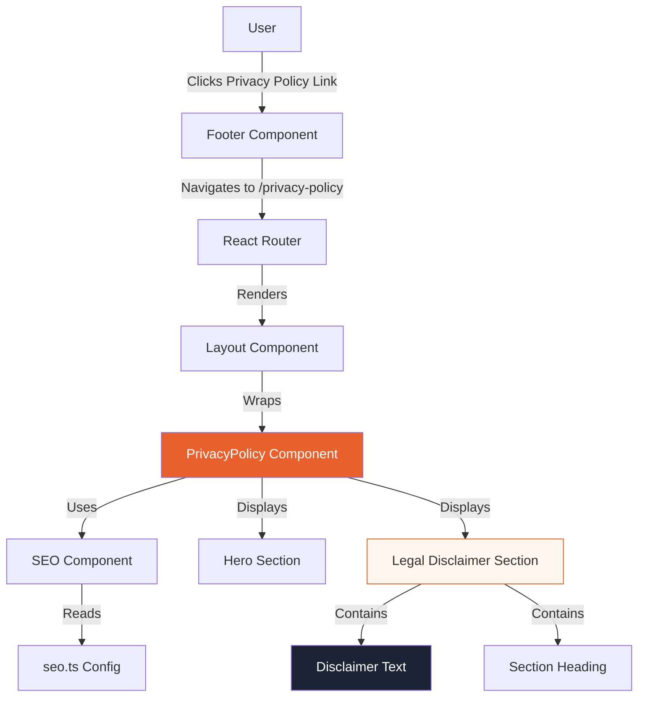
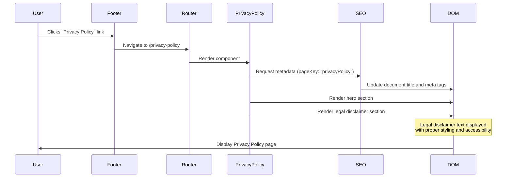

# Design Document: Legal Disclaimer Privacy Policy Page

## Overview

This design specifies the implementation of a Privacy Policy page that includes the mandatory legal disclaimer from SRS Section 14. The page will be accessible at `/privacy-policy` and will follow the established design patterns used in other informational pages (About, CSR, R&D).

### Purpose

The Privacy Policy page serves two primary purposes:
1. Display the mandatory legal disclaimer protecting McRAYGOR's intellectual property
2. Provide a destination for the Privacy Policy link in the footer

### Scope

This implementation includes:
- Creating a new `PrivacyPolicy` React component
- Adding route configuration for `/privacy-policy`
- Updating the Footer component to link to the new page
- Adding SEO metadata configuration
- Ensuring responsive design and accessibility compliance

## Architecture

### Component Structure

```
src/app/
├── pages/
│   └── PrivacyPolicy.tsx          # New Privacy Policy page component
├── routes.tsx                      # Updated with new route
├── components/
│   ├── layout/
│   │   └── Footer.tsx             # Updated Privacy Policy link
│   └── SEO.tsx                    # Existing SEO component (reused)
└── utils/
    └── seo.ts                     # Updated with Privacy Policy metadata
```

### Component Architecture Diagram



### Design Pattern Consistency

The Privacy Policy page will follow the same architectural pattern as existing informational pages:
- Hero section with gradient background
- Content sections with consistent spacing and typography
- Responsive grid layouts
- SEO component integration
- Consistent color scheme (#1c2535, #e8612c, #1a5c3a)

## Components and Interfaces

### PrivacyPolicy Component

**File:** `src/app/pages/PrivacyPolicy.tsx`

**Component Structure:**
```typescript
export function PrivacyPolicy() {
  return (
    <>
      <SEO pageKey="privacyPolicy" />
      {/* Hero Section */}
      {/* Legal Disclaimer Section */}
      {/* Additional Privacy Information Section (optional) */}
    </>
  );
}
```

**Sections:**

1. **Hero Section**
   - Full-width banner with gradient background
   - Page title: "Privacy Policy"
   - Subtitle explaining the page purpose
   - Consistent with About, CSR, R&D hero patterns

2. **Legal Disclaimer Section**
   - Prominent heading: "Intellectual Property & Legal Notice"
   - Legal disclaimer text in a visually distinct container
   - Background color or border to emphasize importance
   - Sufficient padding and spacing for readability

3. **Additional Content Section (Optional)**
   - Placeholder for future privacy policy content
   - Can include data collection practices, cookie policies, etc.
   - Maintains consistent styling with legal disclaimer section

### Route Configuration

**File:** `src/app/routes.tsx`

Add new route entry:
```typescript
{ path: "privacy-policy", Component: PrivacyPolicy }
```

Import statement:
```typescript
import { PrivacyPolicy } from "./pages/PrivacyPolicy";
```

### Footer Component Update

**File:** `src/app/components/layout/Footer.tsx`

**Current Implementation:**
```typescript
<a href="#" className="text-xs text-gray-500 hover:text-gray-300 transition-colors">
  Privacy Policy
</a>
```

**Updated Implementation:**
```typescript
<Link to="/privacy-policy" className="text-xs text-gray-500 hover:text-gray-300 transition-colors">
  Privacy Policy
</Link>
```

### SEO Configuration

**File:** `src/app/utils/seo.ts`

Add new entry to `seoConfig`:
```typescript
privacyPolicy: {
  title: "Privacy Policy & Legal Disclaimer | McRAYGOR®",
  description: "McRAYGOR Privacy Policy and legal disclaimer. Information about intellectual property protection, legal restrictions, and patented technologies.",
  keywords: "privacy policy, legal disclaimer, intellectual property, McRAYGOR legal, terms and conditions",
  canonical: `${BASE_URL}/privacy-policy`,
  ogTitle: "McRAYGOR Privacy Policy & Legal Disclaimer",
  ogDescription: "Privacy policy and legal information for McRAYGOR Mechanicals Infrastructure.",
  ogImage: DEFAULT_OG_IMAGE,
  ogType: "website",
}
```

## Data Models

### Legal Disclaimer Content

The legal disclaimer text is a static constant that must match SRS Section 14 exactly:

```typescript
const LEGAL_DISCLAIMER_TEXT = 
  "Unauthorized reproduction, modification, or misuse of McRAYGOR equipment, " +
  "designs, or intellectual property without written permission is a punishable " +
  "offense. Certain products and technologies are patented.";
```

**Validation Requirements:**
- Text must include all three key phrases:
  1. "Unauthorized reproduction, modification, or misuse"
  2. "without written permission is a punishable offense"
  3. "Certain products and technologies are patented"
- Text must not be truncated or hidden by CSS
- Text must be rendered as semantic HTML (not images or canvas)

### Component Props

The PrivacyPolicy component requires no props as it displays static content.

### Data Flow Diagram



## Correctness Properties

*A property is a characteristic or behavior that should hold true across all valid executions of a system—essentially, a formal statement about what the system should do. Properties serve as the bridge between human-readable specifications and machine-verifiable correctness guarantees.*


### Property 1: Privacy Policy Page Route Accessibility

*For any* request to the `/privacy-policy` route, the application should render the Privacy Policy page successfully without errors.

**Validates: Requirements 1.1, 1.3**

### Property 2: Footer Privacy Policy Link Navigation

*For any* rendered Footer component, the Privacy Policy link should have a `to` attribute pointing to `/privacy-policy`.

**Validates: Requirements 1.2**

### Property 3: Legal Disclaimer Text Presence

*For any* rendered Privacy Policy page, the page should contain the complete legal disclaimer text: "Unauthorized reproduction, modification, or misuse of McRAYGOR equipment, designs, or intellectual property without written permission is a punishable offense. Certain products and technologies are patented."

**Validates: Requirements 2.1, 2.2, 4.1, 4.2, 4.3**

### Property 4: Legal Disclaimer Section Heading

*For any* rendered Privacy Policy page, the legal disclaimer should appear under a heading containing "Intellectual Property" and "Legal Notice".

**Validates: Requirements 2.3**

### Property 5: Legal Disclaimer Content Area Placement

*For any* rendered Privacy Policy page, the legal disclaimer should be located within the main content area (not in header or footer elements).

**Validates: Requirements 2.4**

### Property 6: Legal Disclaimer Font Size

*For any* rendered Privacy Policy page, the legal disclaimer text should have a computed font size of at least 14 pixels.

**Validates: Requirements 3.2**

### Property 7: Legal Disclaimer Responsive Text Wrapping

*For any* viewport width less than 768 pixels, the legal disclaimer text should wrap appropriately without horizontal overflow.

**Validates: Requirements 3.4**

### Property 8: Legal Disclaimer Text Visibility

*For any* rendered Privacy Policy page, the legal disclaimer element should not have CSS properties that truncate or hide text (overflow: hidden with fixed height, text-overflow: ellipsis).

**Validates: Requirements 4.4**

### Property 9: Legal Disclaimer Semantic HTML

*For any* rendered Privacy Policy page, the legal disclaimer should be rendered as semantic HTML text content (not as images, canvas, or SVG text).

**Validates: Requirements 5.1**

### Property 10: Legal Disclaimer Screen Reader Accessibility

*For any* rendered Privacy Policy page, the legal disclaimer should be present in the accessibility tree (not hidden with aria-hidden="true" or display: none).

**Validates: Requirements 5.2**

### Property 11: Legal Disclaimer Contrast Ratio

*For any* rendered Privacy Policy page, the legal disclaimer text should maintain a contrast ratio of at least 4.5:1 against its background color.

**Validates: Requirements 3.1, 5.3**

### Property 12: Heading Hierarchy

*For any* rendered Privacy Policy page, the heading elements should follow proper hierarchy (h1 before h2, h2 before h3) without skipping levels.

**Validates: Requirements 5.4**

## Error Handling

### Route Not Found

If a user navigates to an invalid route, the existing React Router error handling will display a 404 page. The Privacy Policy route will be added to the valid routes list, preventing 404 errors for `/privacy-policy`.

### Missing SEO Configuration

If the SEO configuration for `privacyPolicy` is missing from `seo.ts`, the SEO component should gracefully handle the missing data by using default values or the home page metadata as fallback.

**Implementation:**
```typescript
const metadata = seoConfig[pageKey] || seoConfig.home;
```

### Component Rendering Errors

If the PrivacyPolicy component encounters a rendering error, React's error boundary (if implemented) should catch the error and display a fallback UI. The error should be logged for debugging purposes.

### Accessibility Failures

If the contrast ratio calculation fails or returns an invalid value during testing, the test should fail with a clear error message indicating:
- The computed foreground color
- The computed background color
- The calculated contrast ratio
- The required minimum ratio (4.5:1)

## Testing Strategy

### Dual Testing Approach

This feature will be tested using both unit tests and property-based tests to ensure comprehensive coverage:

**Unit Tests** will focus on:
- Specific examples of route navigation
- Footer link configuration
- SEO metadata presence
- Component rendering without errors
- Accessibility tree structure
- Heading hierarchy validation

**Property-Based Tests** will focus on:
- Text content validation across different rendering contexts
- Responsive behavior across various viewport sizes
- Contrast ratio calculations with different theme configurations
- CSS property validation across different browser environments

### Testing Framework

**Unit Testing:**
- Framework: Vitest + React Testing Library
- Component rendering tests
- DOM query tests
- Accessibility tests using @testing-library/jest-dom

**Property-Based Testing:**
- Framework: fast-check (JavaScript property-based testing library)
- Minimum 100 iterations per property test
- Each test tagged with: **Feature: legal-disclaimer, Property {number}: {property_text}**

### Test Categories

#### 1. Route and Navigation Tests (Unit Tests)

**Test: Privacy Policy route exists**
- Navigate to `/privacy-policy`
- Assert page renders without errors
- Assert page contains "Privacy Policy" heading

**Test: Footer link points to Privacy Policy**
- Render Footer component
- Find Privacy Policy link
- Assert `to` attribute equals `/privacy-policy`

#### 2. Content Validation Tests (Unit Tests)

**Test: Legal disclaimer text is present**
- Render PrivacyPolicy component
- Query for disclaimer text
- Assert complete disclaimer text is in the document

**Test: Legal disclaimer has proper heading**
- Render PrivacyPolicy component
- Find heading containing "Intellectual Property" and "Legal Notice"
- Assert disclaimer text appears after this heading

**Test: Legal disclaimer is in main content area**
- Render PrivacyPolicy component
- Find disclaimer element
- Assert it's within a main or article element, not in header/footer

#### 3. Visual Presentation Tests (Unit Tests)

**Test: Legal disclaimer font size meets minimum**
- Render PrivacyPolicy component
- Get computed styles of disclaimer text
- Assert font-size >= 14px

**Test: Legal disclaimer text is not truncated**
- Render PrivacyPolicy component
- Get computed styles of disclaimer container
- Assert no overflow:hidden with fixed height
- Assert no text-overflow:ellipsis

#### 4. Responsive Design Tests (Property-Based Tests)

**Property Test: Responsive text wrapping**
- **Tag:** Feature: legal-disclaimer, Property 7: Responsive text wrapping
- **Iterations:** 100
- **Generator:** Random viewport widths from 320px to 767px
- **Test:** For each viewport width:
  - Render component at that width
  - Assert disclaimer container width <= viewport width
  - Assert no horizontal scrollbar

#### 5. Accessibility Tests (Unit Tests)

**Test: Legal disclaimer is semantic HTML**
- Render PrivacyPolicy component
- Find disclaimer element
- Assert it's a text element (p, div, span) not img/canvas/svg

**Test: Legal disclaimer is in accessibility tree**
- Render PrivacyPolicy component
- Query disclaimer using accessible queries
- Assert element is not aria-hidden
- Assert element is not display:none

**Test: Contrast ratio meets WCAG AA**
- Render PrivacyPolicy component
- Get computed foreground and background colors
- Calculate contrast ratio
- Assert ratio >= 4.5:1

**Test: Heading hierarchy is proper**
- Render PrivacyPolicy component
- Get all heading elements (h1-h6)
- Assert h1 appears before any h2
- Assert h2 appears before any h3
- Assert no level skipping

#### 6. SEO Tests (Unit Tests)

**Test: SEO metadata is configured**
- Import seoConfig
- Assert privacyPolicy key exists
- Assert title, description, keywords are non-empty
- Assert canonical URL is correct

**Test: SEO component renders metadata**
- Render PrivacyPolicy component
- Check document.title
- Check meta tags in document.head
- Assert correct values from seoConfig

### Test Coverage Goals

- **Component Coverage:** 100% of PrivacyPolicy component code
- **Route Coverage:** Privacy Policy route tested
- **Accessibility Coverage:** All WCAG AA requirements tested
- **Content Coverage:** All required text phrases validated
- **Responsive Coverage:** Mobile (320px-767px) and desktop (768px+) viewports

### Continuous Integration

All tests should run in the CI/CD pipeline:
1. Unit tests run on every commit
2. Property-based tests run on every pull request
3. Accessibility tests run with axe-core integration
4. Visual regression tests (if implemented) compare screenshots

### Manual Testing Checklist

Before marking the feature complete, manually verify:
- [ ] Navigate to `/privacy-policy` in browser
- [ ] Click Privacy Policy link in footer
- [ ] Read disclaimer text for accuracy
- [ ] Test on mobile device (< 768px width)
- [ ] Test with screen reader (NVDA/JAWS/VoiceOver)
- [ ] Verify contrast in browser DevTools
- [ ] Check heading outline in browser DevTools
- [ ] Verify SEO metadata in browser DevTools

## Implementation Notes

### Styling Considerations

The legal disclaimer should be visually emphasized to ensure users notice it:

**Recommended styling approach:**
- Background color: Light gray (#f9fafb) or light orange tint (#fff7ed)
- Border: Subtle border or left accent border in brand color (#e8612c)
- Padding: Generous padding (2rem) for breathing room
- Font weight: Medium (500) or semi-bold (600) for emphasis
- Line height: 1.7-1.8 for readability

**Example CSS structure:**
```css
.legal-disclaimer-container {
  background: #fff7ed;
  border-left: 4px solid #e8612c;
  padding: 2rem;
  border-radius: 0.5rem;
}

.legal-disclaimer-text {
  font-size: 1rem; /* 16px */
  line-height: 1.75;
  color: #1c2535;
  font-weight: 500;
}
```

### Responsive Breakpoints

Follow the existing breakpoint system:
- Mobile: < 768px
- Tablet: 768px - 1023px
- Desktop: >= 1024px

At mobile breakpoints:
- Reduce padding to 1.5rem
- Maintain font size (don't reduce below 14px)
- Ensure text wraps naturally

### Content Management

The legal disclaimer text should be defined as a constant at the top of the PrivacyPolicy component file for easy updates:

```typescript
const LEGAL_DISCLAIMER = {
  heading: "Intellectual Property & Legal Notice",
  text: "Unauthorized reproduction, modification, or misuse of McRAYGOR equipment, " +
        "designs, or intellectual property without written permission is a punishable " +
        "offense. Certain products and technologies are patented."
};
```

This approach:
- Makes the text easy to find and update
- Ensures consistency across the component
- Facilitates testing (can import the constant in tests)
- Provides a single source of truth

### Future Enhancements

The Privacy Policy page is designed to accommodate future additions:

**Potential future sections:**
1. Data Collection Practices
2. Cookie Policy
3. Third-Party Services
4. User Rights (GDPR compliance)
5. Contact Information for Privacy Concerns
6. Last Updated Date

The component structure should allow adding these sections without refactoring the legal disclaimer section.

## Dependencies

### External Dependencies

No new external dependencies are required. The implementation uses existing libraries:
- React (already installed)
- React Router (already installed)
- Lucide React icons (already installed, optional for decorative icons)

### Internal Dependencies

The implementation depends on existing components and utilities:
- `src/app/components/SEO.tsx` - For SEO metadata
- `src/app/components/layout/Layout.tsx` - For page layout wrapper
- `src/app/utils/seo.ts` - For SEO configuration
- `src/app/routes.tsx` - For route configuration

### Build Dependencies

Testing dependencies (should already be installed):
- Vitest - Unit testing framework
- @testing-library/react - React component testing
- @testing-library/jest-dom - DOM matchers
- fast-check - Property-based testing library

## Deployment Considerations

### Sitemap Update

After deploying the Privacy Policy page, update the sitemap:

**File:** `public/sitemap.xml`

Add entry:
```xml
<url>
  <loc>https://www.mcraygor.com/privacy-policy</loc>
  <lastmod>2024-01-XX</lastmod>
  <changefreq>monthly</changefreq>
  <priority>0.5</priority>
</url>
```

**File:** `src/app/pages/Sitemap.tsx`

Add Privacy Policy to the HTML sitemap page.

### Analytics Tracking

Ensure Google Analytics tracks page views for `/privacy-policy`:
- Verify page view events are firing
- Set up goal tracking if needed (e.g., time spent on page)
- Monitor bounce rate and user engagement

### Performance Considerations

The Privacy Policy page is lightweight and should load quickly:
- No heavy images or videos
- Minimal JavaScript (just React components)
- Static content (no API calls)
- Expected load time: < 1 second on 3G connection

### SEO Verification

After deployment, verify SEO implementation:
1. Check Google Search Console for indexing
2. Verify meta tags using browser DevTools
3. Test social media sharing (Open Graph tags)
4. Validate structured data (if added)
5. Check mobile-friendliness in Google's Mobile-Friendly Test

## Security Considerations

### Content Security

The legal disclaimer text is static and hardcoded, preventing:
- XSS attacks through user input
- Content injection
- Unauthorized modifications

### No User Input

The Privacy Policy page displays static content only and accepts no user input, minimizing security risks.

### HTTPS Enforcement

Ensure the Privacy Policy page is served over HTTPS (should be enforced site-wide).

## Accessibility Compliance Summary

The Privacy Policy page will meet WCAG 2.1 Level AA standards:

✓ **Perceivable:**
- Text contrast ratio >= 4.5:1
- Semantic HTML structure
- Responsive text sizing
- No text truncation

✓ **Operable:**
- Keyboard navigation supported (via React Router Link)
- No time limits on reading content
- Clear focus indicators (inherited from site-wide styles)

✓ **Understandable:**
- Clear heading hierarchy
- Plain language (legal text is inherently complex but clearly structured)
- Consistent navigation (footer link)

✓ **Robust:**
- Valid HTML5
- Screen reader compatible
- Works across modern browsers
- Responsive across devices

## Conclusion

This design provides a comprehensive specification for implementing the Privacy Policy page with the mandatory legal disclaimer. The implementation follows established patterns from existing pages, ensures accessibility compliance, and provides a foundation for future privacy-related content additions.

The dual testing approach (unit tests + property-based tests) ensures both specific examples and general properties are validated, providing confidence in the correctness of the implementation.
